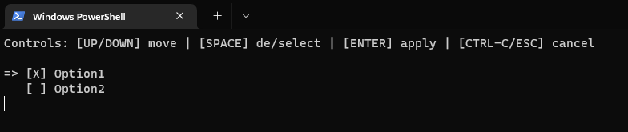

# Python MultiSelect UI for Windows Terminal

A multiselect UI for Windows Terminal only, without depending on any external package.

## Usage

```python
from multiselect import multiselect

selected_indexes = multiselect(['Option1', 'Option2'], [0])
print(selected_indexes)  # [0]
```



